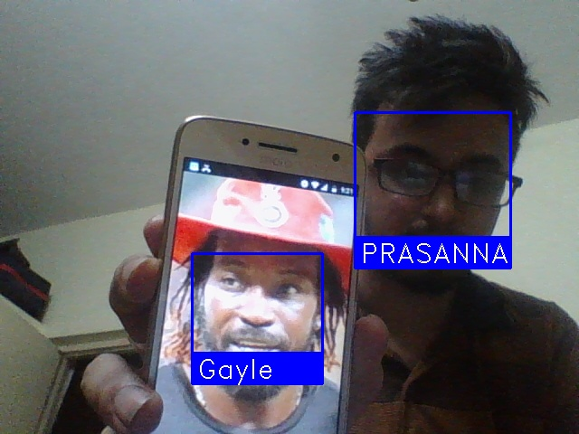
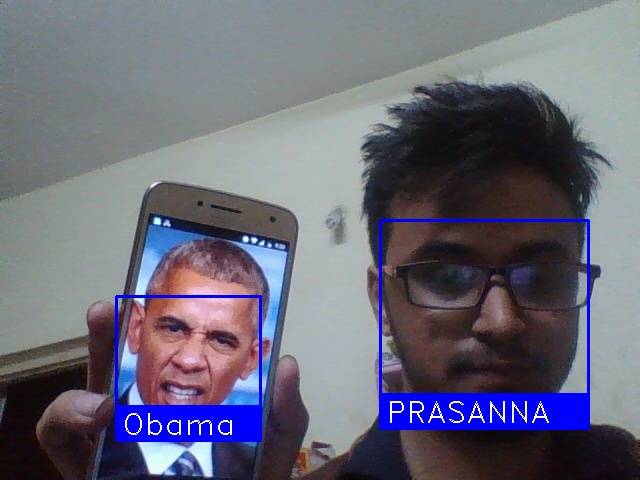
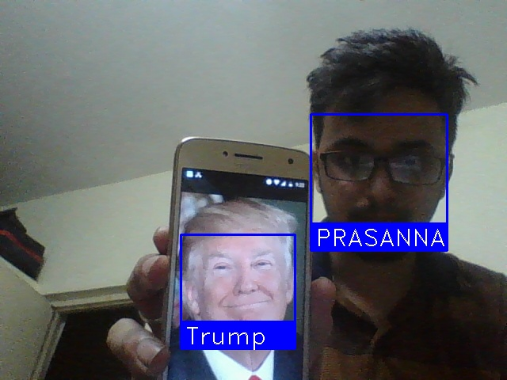
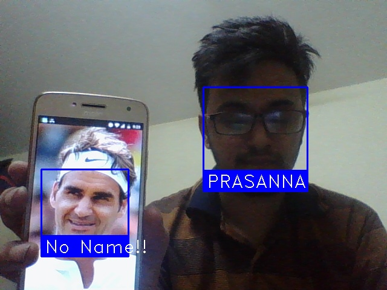

<h2>FaceRecognition-tool</h2>

A simple, modular face recognition tool, can be used for demo or can be embedded inside applications.

Built using OpenFace. 

<h3>How to run?</h3>

Install all dependencies, installation instructions can be found <a href = "https://github.com/ageitgey/face_recognition">here</a>

Steps:

1. change NAME variable in FaceGenerator.py to your name

2. Run FaceGenerator.py until you are satisfied with your pose, make sure facial features are clearly visible. 

3. Press 'q' to stop, now the application will automatically generate the NAME.npy file for the image.

4. Now run RealTime.py, the app will automatically recognize image. 

You can also copy the image directly into KnownFaces directory, the name of file should be the name to be displayed if face is recognised.
Make sure you generate encodings for newly placed image by calling, encode_single() of Encodings.py module.

<h3>How to integrate with other apps? </h3>

The major component of face recognition system is generation of encoding for each face, this app has functions to produce and retrive
 encodings, <strong>Encoding.py</strong> module contains 3 classes : 

 
1. <strong>Encode(Thread):</strong> Base class which generates an encoding file for given image file. This class extends Thread class, 
 so this class should be executed as a thread always, by calling start() method on the class.

 
2. <strong>InitlaizeEncodingsOfKnownFaces:</strong> Base class which can be used to obtain all currently previously available encoding files.

 
 Parameters : encoding_directory : Specifies the diectory which contains encoding files 

 
 getEncodings() : This function returns an array of structure : [{name : encoding},..] where name represents the label and
 encoding is a numpy array representing encoded data. 

 
 
<strong>Functions: 

 
 encode_all_faces() : Generates a pool of threads, where each thread is an instance of Encode(Thread) object , this function can be
 called to generate encoding files of all known images.

 
<strong>encode_single(filename):<strong> Generate encoding for a single image file, specifiy image file as parameter

 
 <h3>Result: </h3>
 
1. 

 
 
 
2. 

 
 
 
3. 

 
 
 
4. 

 
 
 
6. 

 
 
 
 
 
